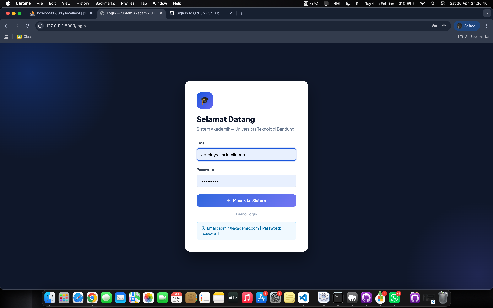
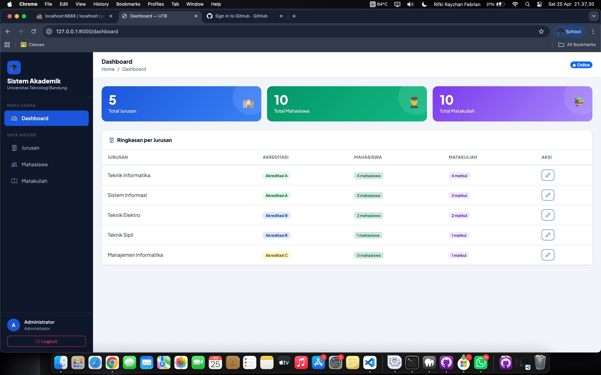
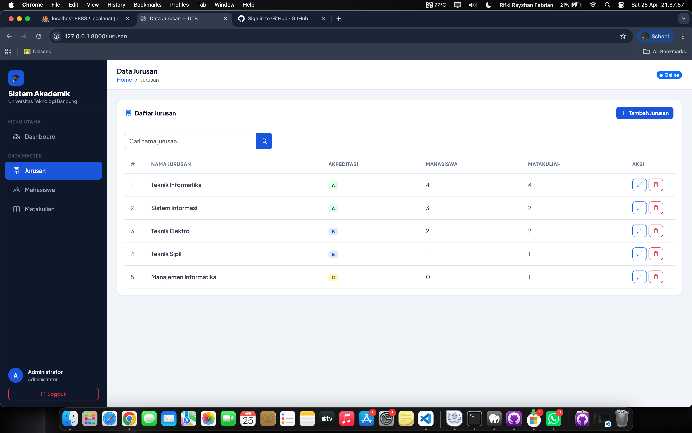
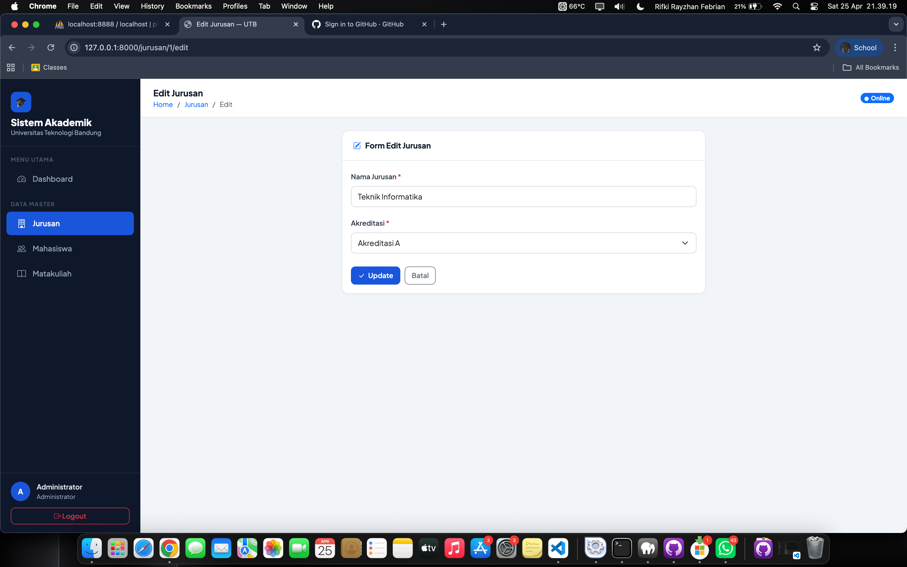
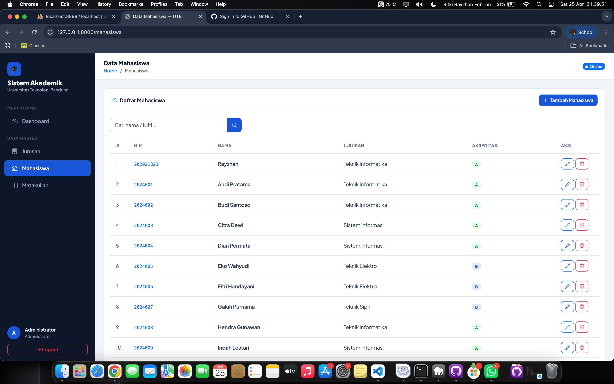
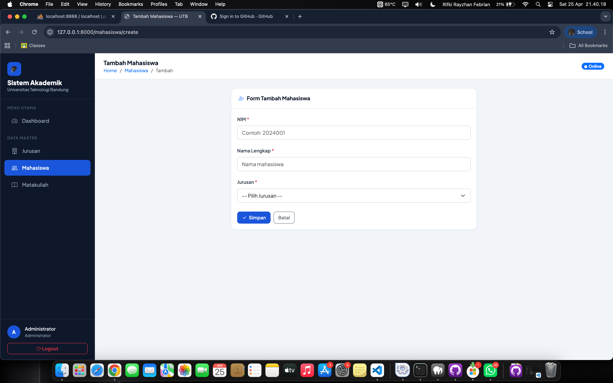
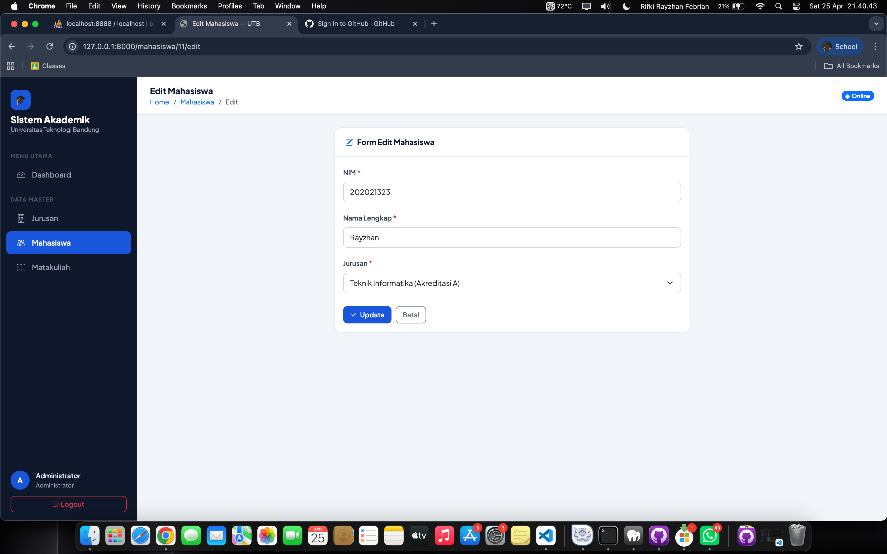
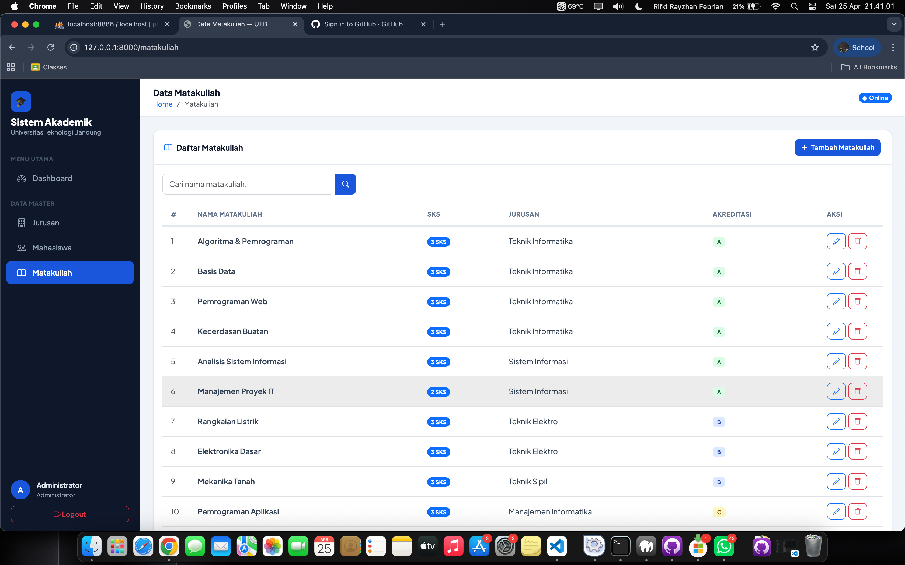
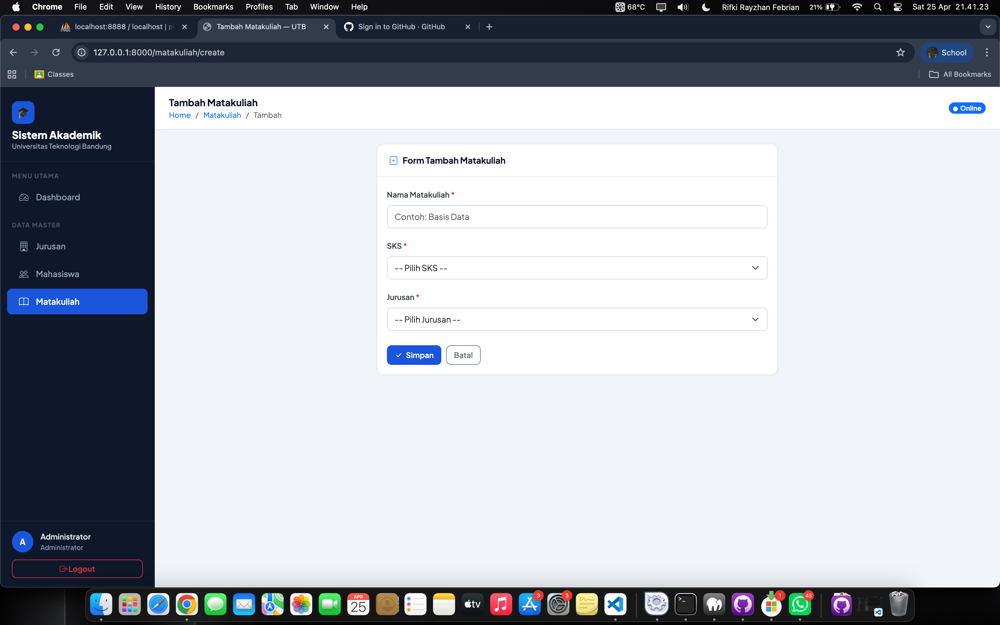

cat > README.md << 'READMEEOF'
# 🎓 Sistem Akademik Sederhana

> Ujian Tengah Semester — Pemrograman Web 2

---

## Identitas Mahasiswa

| | |
|--|--|
| **Nama** | Rifki Febrian |
| **NIM** | 23552011430 |
| **Kelas** | TIF RM 23A |
| **Dosen Pengampu** | Ipan Saepul Milal, S.Kom. |
| **Mata Kuliah** | Pemrograman Web 2 / 3 SKS |
| **Universitas** | Universitas Teknologi Bandung |

---

## Deskripsi

Aplikasi web berbasis **Laravel 12 + MySQL** untuk mengelola data akademik sederhana meliputi Jurusan, Mahasiswa, dan Matakuliah dengan fitur autentikasi dan CRUD lengkap.

---

## Teknologi

- **Framework:** Laravel 12
- **Database:** MySQL
- **Frontend:** Bootstrap 5 + Bootstrap Icons
- **Auth:** Laravel Breeze
- **Font:** Plus Jakarta Sans

---

## Struktur Database

### Tabel jurusan
| Kolom | Tipe | Keterangan |
|-------|------|------------|
| id_jurusan | BIGINT PK | Primary Key |
| nama_jurusan | VARCHAR | Nama jurusan |
| akreditasi | VARCHAR | A / B / C |
| created_at | TIMESTAMP | - |
| updated_at | TIMESTAMP | - |

### Tabel mahasiswa
| Kolom | Tipe | Keterangan |
|-------|------|------------|
| id_mahasiswa | BIGINT PK | Primary Key |
| nim | VARCHAR | Nomor Induk Mahasiswa |
| nama | VARCHAR | Nama lengkap |
| id_jurusan | BIGINT FK | Foreign Key ke jurusan |
| created_at | TIMESTAMP | - |
| updated_at | TIMESTAMP | - |

### Tabel matakuliah
| Kolom | Tipe | Keterangan |
|-------|------|------------|
| id_matakuliah | BIGINT PK | Primary Key |
| nama_matakuliah | VARCHAR | Nama matakuliah |
| sks | INT | Jumlah SKS |
| id_jurusan | BIGINT FK | Foreign Key ke jurusan |
| created_at | TIMESTAMP | - |
| updated_at | TIMESTAMP | - |

---

## Relasi Antar Tabel

- Jurusan memiliki banyak Mahasiswa (One to Many)
- Jurusan memiliki banyak Matakuliah (One to Many)
- Mahasiswa milik satu Jurusan (Belongs To)
- Matakuliah milik satu Jurusan (Belongs To)

---

##  Fitur

- Authentication — Login wajib, middleware auth melindungi semua route
- Dashboard — Ringkasan statistik jurusan, mahasiswa, matakuliah
- CRUD Jurusan — Tambah, tampilkan, edit, hapus
- CRUD Mahasiswa — Tambah, tampilkan dengan relasi jurusan, edit, hapus
- CRUD Matakuliah — Tambah, tampilkan dengan relasi jurusan, edit, hapus
- Validasi Form — Request validation di semua form
- **Export CSV** untuk semua tabel
- **Export Excel (XLS)** untuk Jurusan & Matakuliah
- **Print PDF** untuk semua tabel
- Seeder — Data dummy siap pakai
- Pagination — 10 data per halaman
- Search — Pencarian data di setiap tabel

---

## Cara Instalasi

1. Clone repository
   git clone https://github.com/USERNAME/sistem-akademik.git
   cd sistem-akademik

2. Install dependencies
   composer install
   npm install && npm run build

3. Setup environment
   cp .env.example .env
   php artisan key:generate

4. Setting database di .env
   DB_DATABASE=sistem_akademik
   DB_USERNAME=root
   DB_PASSWORD=

5. Migrate dan Seeder
   php artisan migrate:fresh --seed

6. Jalankan server
   php artisan serve

---

## Akun Login Default

| Email | Password |
|-------|----------|
| admin@akademik.com | password |

---

## Screenshots

### Halaman Login


### Dashboard


### Jurusan - Index


### Jurusan - Tambah


### Jurusan - Edit


### Mahasiswa - Index


### Mahasiswa - Tambah


### Mahasiswa - Edit


### Matakuliah - Index


### Matakuliah - Tambah


### Matakuliah - Edit


---

##  Database

File SQL tersedia di: sistem_akademik.sql

Link Database:
https://github.com/rynrifn/sistem-akademik/blob/main/sistem_akademik.sql

Import ke MySQL:
   mysql -u root -h 127.0.0.1 sistem_akademik < sistem_akademik.sql

---

## 📁 Struktur Folder

```
sistem-akademik/
├── app/
│   ├── Http/Controllers/
│   │   ├── DashboardController.php
│   │   ├── JurusanController.php
│   │   ├── MahasiswaController.php
│   │   └── MatakuliahController.php
│   └── Models/
│       ├── Jurusan.php
│       ├── Mahasiswa.php
│       └── Matakuliah.php
├── database/
│   ├── migrations/
│   └── seeders/
├── resources/views/
│   ├── layouts/app.blade.php
│   ├── auth/login.blade.php
│   ├── dashboard.blade.php
│   ├── jurusan/
│   ├── mahasiswa/
│   └── matakuliah/
├── routes/web.php
├── screenshots/
└── sistem_akademik.sql
```

---

*Dibuat oleh Rifki Febrian (23552011430) — UTS Pemrograman Web 2, April 2026*
